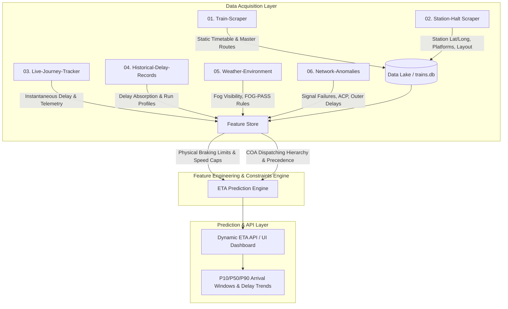

ok# SIH-DETA: Indian Railways Dynamic ETA Prediction System 🚆⚡

> **Smart India Hackathon (SIH) Project**: A multi-tiered, physics-informed, and data-driven Dynamic Estimated Time of Arrival (ETA) calculation and prediction system for Indian Railways.

---

## 🏗️ High-Level System Architecture



---

## 📁 Repository Directory Structure

The project is structured into **7 specialized, modular components**:

```text
SIH-DETA/
├── README.md                            <-- (This file) Master Architecture Documentation
│
├── Train-Scraper/                       <-- [01. Train Master & Static Schedules]
│   ├── config.py                        <-- Central endpoints & rate-limits
│   ├── main.py                          <-- Unified CLI runner
│   ├── scrapers/                        <-- ConfirmTkt, eTrain, & Datameet parsers
│   ├── storage/                         <-- SQLite database & CSV/JSON exporter
│   └── data/                            <-- 5,208+ trains DB, JSON & CSV exports
│
├── Station-Halt Scraper/                <-- [02. Station Network & Node Topology]
│   └── README.md                        <-- Station master, yard capacity, lat/long
│
├── Live-Journey-Tracker/                <-- [03. Real-Time Telemetry & Feeds]
│   └── README.md                        <-- NTES/RTIS instantaneous delay & speed
│
├── Historical-Delay-Records/            <-- [04. Historical Punctuality & Recovery]
│   └── README.md                        <-- Sectional delay propagation & slack analysis
│
├── Weather-Environment/                 <-- [05. Environmental & Weather Constraints]
│   └── README.md                        <-- Fog (FOG-PASS rule), monsoon, heat alerts
│
├── Network-Anomalies/                   <-- [06. Stochastic Incidents & Bottlenecks]
│   └── README.md                        <-- Signal failure, ACP, CRO, outer signal wait
│
└── ETA-Prediction-Engine/               <-- [07. ML & Physics-Informed Prediction Engine]
    └── README.md                        <-- Feature pipeline, GNN / LightGBM models
```

---

## 🧩 Module Breakdown & Responsibilities

| # | Module Folder | Primary Role | Key Output / Schema |
|---|---|---|---|
| **01** | [`Train-Scraper/`](file:///scratch/home/sid01/SIH-DETA/Train-Scraper/) | Master train directory, 5-digit IR numbering catalog, route stop sequences, classes. | `master_trains.csv`, `train_schedules.json`, `trains.db` |
| **02** | [`Station-Halt Scraper/`](file:///scratch/home/sid01/SIH-DETA/Station-Halt%20Scraper/) | Station topology, GPS coordinates, junction vs. halt categorization, platform counts. | `stations.csv`, station yard graph |
| **03** | [`Live-Journey-Tracker/`](file:///scratch/home/sid01/SIH-DETA/Live-Journey-Tracker/) | Polls real-time position, last crossed station, ATD, and current instantaneous delay ($\Delta t_0$). | `live_telemetry.json`, `live_delays.csv` |
| **04** | [`Historical-Delay-Records/`](file:///scratch/home/sid01/SIH-DETA/Historical-Delay-Records/) | Models delay propagation and recovery over day of week, hour, and section. | `delay_history.csv` |
| **05** | [`Weather-Environment/`](file:///scratch/home/sid01/SIH-DETA/Weather-Environment/) | Encodes weather speed caps (e.g. Fog visibility < 600m $\to$ 60/75 km/h limit). | `weather_features.csv` |
| **06** | [`Network-Anomalies/`](file:///scratch/home/sid01/SIH-DETA/Network-Anomalies/) | Outer home signal queuing, Alarm Chain Pulling (ACP), Cattle Run-Over (CRO), S&T faults. | `anomalies.csv` |
| **07** | [`ETA-Prediction-Engine/`](file:///scratch/home/sid01/SIH-DETA/ETA-Prediction-Engine/) | Feature fusion, ML/GNN training, inference API predicting arrival times and confidence intervals. | Predicted ETA (P10/P50/P90), API endpoints |

---

## 🚦 Indian Railways Operational Rules & Authority Systems

To achieve realistic accuracy, the system models the operational realities of Indian Railways:

### 1. Indian Railways Authority Systems (CRIS & ISRO)
- **COA (Control Office Application):** The master software used by Section Controllers in all 68 divisional control rooms to manually or semi-automatically plot train precedence and crossing charts.
- **RTIS (Real-Time Train Information System):** Jointly developed by CRIS and ISRO. Locomotives carry GPS/GAGAN satellite transponders that transmit position updates every 30 seconds directly into COA.
- **NTES (National Train Enquiry System):** Public passenger tracking layer fed by COA with a ~2 to 5-minute update latency.

### 2. Right-of-Way & Dispatching Hierarchy
When two trains compete for the same track section or platform, Section Controllers strictly follow this precedence hierarchy:
1. **Accident Relief Trains (ARME / ART)** (Highest priority)
2. **Vande Bharat, Rajdhani, Shatabdi, Tejas Express**
3. **Premium Superfast & Duronto Express**
4. **Regular Mail / Express trains**
5. **Passenger / MEMU / DEMU local trains**
6. **Freight / Goods Trains** (Container $\to$ Coal/Ores)

### 3. Braking Physics & Speed Regulations (G&SR Rules)
- **LHB vs ICF Braking Distance:** Modern LHB coaches with twin-pipe disc brakes stop in ~1,000–1,200 meters at 130 km/h. Older ICF coaches with shoe brakes require ~1,400+ meters at 110 km/h.
- **Fog Rules (FOG-PASS):** Under Indian Railway G&SR, during dense fog (visibility < 600m), trains are legally restricted to **60 km/h** (or **75 km/h** if loco has a GPS FOG-PASS unit).
- **Timetable Slack (Recovery Allowance):** Schedules contain 5%–15% built-in slack before major junctions. A train 30 mins late can absorb this delay if the line ahead is clear.

---

## ⚡ Quick Start: Running the Train Scraper

```bash
# Navigate to the train scraper module
cd Train-Scraper

# 1. Discover active trains via prefix crawler
python3 main.py --mode discover --concurrency 4 --delay 0.3

# 2. Scrape detailed stops and schedule for a train
python3 main.py --mode schedule --train 12301

# 3. Synchronize master database (5,208+ trains)
python3 main.py --mode sync-master

# 4. Search trains in the local database
python3 main.py --mode search --query "Vande Bharat"

# 5. Run test suite
python3 tests/test_scraper.py
```
