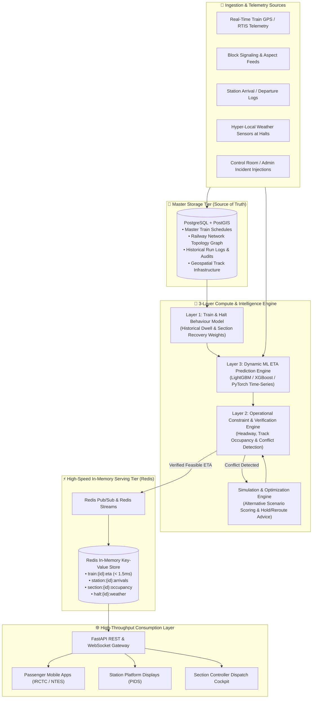
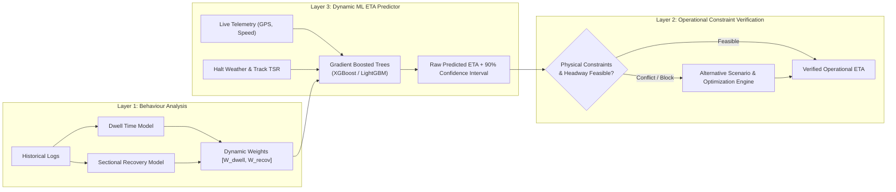
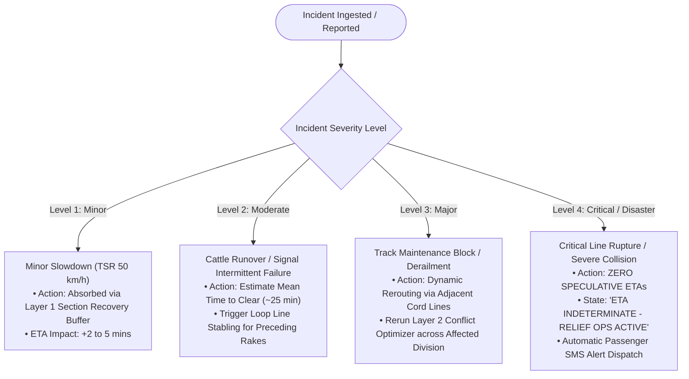

# 🚆 RailPulse: Real-Time Dynamic ETA Prediction & Railway Network Intelligence System
> **Smart India Hackathon (SIH) | Ministry of Railways / Indian Railways**  
> *A high-throughput, graph-based operational intelligence & machine learning platform for real-time coaching train ETA forecasting.*

---

## 📌 Executive Summary & Problem Context

Indian Railways operates one of the largest passenger rail networks in the world, running over **13,000 passenger and coaching trains daily** across diverse geographies, weather conditions, and high-density corridors.

### Current Industry Problem
1. **Static & Schedule-Driven Estimates**: Current ETAs rely heavily on static timetable schedules, current station-departure delays, and static in-built recovery buffers. 
2. **Failure under Dynamic Ground Realities**: Static methods fail to account for real-time signal halts, track congestion, cascading precedence, temporary speed restrictions (TSR), unscheduled maintenance blocks, and micro-climatic events (e.g., dense winter fog, monsoonal flash rains).
3. **Severe Downstream Cascading Chaos**:
   - **Station Operations**: Inaccurate arrival times cause platform assignment conflicts and platform overcrowding.
   - **Rake Turnaround & Maintenance**: Pit-line cleaning crews and maintenance staff sit idle or face severe backlog.
   - **Crew Rostering**: Loco-pilots and train managers face duty hour violations and unscheduled relief crew changes.
   - **Multimodal Feeder Transport**: Road transport, feeder buses, and millions of daily commuters experience severe planning uncertainty.

### The Solution: RailPulse
**RailPulse** transforms ETA forecasting from static timetable extrapolation into an **adaptive, real-time cyber-physical graph network**:
- **Main DB (PostgreSQL + PostGIS)** serves as the authoritative, persistent source of truth.
- **In-Memory Redis Layer** delivers microsecond-latency caching and pub/sub streaming to withstand millions of concurrent passenger app hits (NTES, IRCTC) and station Passenger Information Display Systems (PIDS).
- **Dual-Mode Graph Traversal**: Computes aggregate section ETAs during normal flow, while dynamically shifting to **halt-by-halt micro-traversal** when anomalies are detected, analyzing hyper-local halt weather, signal aspects, and speed restrictions.
- **3-Layer Intelligent Engine**: Decouples behavioural learning, physical rail constraints, and machine-learning time-series forecasting.

---

## 🏛️ System Architecture: The High-Throughput Tiered Design

To handle nationwide scale with sub-millisecond query responses, the system strictly separates **heavy compute & transactional persistence** from **live high-concurrency public reads**.



---

## 🗄️ Storage Paradigm: Main Database vs. Redis In-Memory Tier

| Architectural Dimension | Master Persistent Database (PostgreSQL / PostGIS) | Live In-Memory Cache (Redis) |
| :--- | :--- | :--- |
| **Role** | **Authoritative Source of Truth** & Historical Warehouse | **Ultra-Low Latency Serving & Live State Cache** |
| **Data Stored** | Master network graph, track geometries, historical journeys, crew logs, full audit trails | Latest calculated ETAs, live coordinates, section occupancies, active alert flags |
| **Access Pattern** | Batch analytics, ML model training, historical aggregations, admin mutations | High-throughput reads (100,000+ req/sec) with sub-2 millisecond latency |
| **Public Exposure** | **Strictly Private**: Never exposed directly to public traffic or third-party apps | **Gated via API Gateway**: High-speed lookup without touching disk |

### Redis Key-Value Schema Design
```text
# Real-Time Train ETA & Telemetry
train:{train_id}:eta          -> Hash { "next_station": "CNB", "eta_utc": 1726058400, "delay_min": 8.5, "confidence": 0.94 }
train:{train_id}:position     -> Geo  { latitude: 26.8467, longitude: 80.9462, speed_kmh: 88, heading: 114 }
train:{train_id}:route_trace  -> List [ "NDLS", "GZB", "ALJN", "TDL", "CNB", "PRYJ", "DDU" ]

# Station Live Arrival Board
station:{station_id}:arrivals -> SortedSet (Key: train_id, Score: arrival_timestamp_epoch)

# Block Section & Track Occupancy
section:{section_id}:status   -> Hash { "occupant_train_id": 12301, "signal_aspect": "DOUBLE_YELLOW", "tsr_kmh": 45 }

# Halt Micro-Environmental Conditions
halt:{halt_id}:weather        -> Hash { "visibility_m": 80, "precip_mm": 14.2, "condition": "DENSE_FOG", "temp_c": 11 }
```

---

## 🗺️ Railway Network Graph & Dual-Mode Traversal

The railway network is modeled as a **directed time-dependent multi-graph**:
- **Nodes**: Junction Stations, Intermediate Halts, and Signal Interlocking Points.
- **Edges**: Track Block Sections with length, track category, line gradient, signalling type, and maximum permissible speed (MPS).

### Dual-Mode Traversal Logic
Under ideal running conditions, calculating minute-by-minute micro-factors for thousands of trains is computationally redundant. RailPulse introduces an **adaptive dual-mode traversal algorithm**:

```mermaid
flowchart TD
    Start([Train Enters Block Section A → B]) --> CheckVariance{Is Current Section Delay\nVariance > Threshold (e.g. 3 min)\nOR Incident Reported?}

    subgraph NormalMode ["🟢 Mode 1: Normal Section Mode (Fast Path)"]
        CheckVariance -- "NO (Nominal Flow)" --> AggregateCalc["Aggregate Section Running Time Computation\n• Section length / MPS\n• Historical average clearance\n• Standard Layer 1 behaviour weight"]
        AggregateCalc --> FastETA["Publish Aggregate Section ETA (O(1) Evaluation)"]
    end

    subgraph DetailedMode ["🟡 Mode 2: Detailed Halt-by-Halt Traversal Mode (Diagnostic Path)"]
        CheckVariance -- "YES (Anomaly Detected)" --> ExplodeSection["Explode Section into Sub-Elements:\n[Station A] ➔ [Halt 1] ➔ [Signal Post] ➔ [Halt 2] ➔ [Station B]"]
        ExplodeSection --> TraverseHalts["Traverse Halt by Halt Sequentially"]
        
        TraverseHalts --> FetchHaltTelemetry["Query Hyper-Local Telemetry for Each Halt:\n• Local Weather (Visibility, Fog Index, Rain mm/h)\n• Temporary Speed Restrictions (TSR)\n• Preceding Train Headway / Signal Aspect\n• Platform Track Availability at Halt"]
        
        FetchHaltTelemetry --> PinpointBottleneck["Pinpoint Root Cause Node\n(e.g., Dense Fog between Halt 1 & Signal Post)"]
        PinpointBottleneck --> MicroETA["Calculate Granular Segmental Traversal\n+ Progressive Recovery Feasibility"]
    end

    FastETA --> WriteRedis[Update Redis Cache]
    MicroETA --> WriteRedis
```

### Why Halt-Level Micro-Context Matters
When a train delays between major stations (e.g., Kanpur to Prayagraj, ~194 km), conventional systems assume the whole section is uniformly delayed. RailPulse inspects the intermediate halts:
- **Halt 1 (Rooma)**: Clear visibility, normal speed.
- **Halt 2 (Bindki Road)**: **Visibility drops to 70m due to localized river basin fog**, triggering automatic speed restriction (ASR 30 km/h) under Indian Railways fog-safe device (FSD) rules.
- **Result**: The system pinpoints the exact 18-minute loss to Bindki Road rather than guessing an arbitrary downstream delay.

---

## 🧠 The 3-Layer Computational Intelligence Engine



### Layer 1: Train & Halt Behaviour Model
Learns the empirical behavioral DNA of each train and station:
$$\text{DwellWeight} = f(\text{TrainCategory}, \text{RakeType}, \text{PlatformConfig}, \text{TimeOfDay}, \text{DayOfWeek}, \text{Season})$$
- *Example*: A Rajdhani Express has a certified 2-minute halt at a junction, but on festival weekends historically requires $3.8 \pm 0.4$ minutes due to baggage loading dynamics. Layer 1 dynamically scales dwell weights.

### Layer 2: Operational Constraint & Verification Engine
Machine learning models often make physically impossible predictions (e.g., predicting two trains crossing a single-line section simultaneously or predicting acceleration that exceeds traction tractive effort).
- Evaluates:
  1. **Minimum Block Headway** (Absolute Block / Automatic Block separation).
  2. **Track Occupancy & Crossing Precedence** (Higher priority Superfast overtaking Passenger train at loop lines).
  3. **Traction & Braking Limits** (Cannot stop a 24-coach rake in 200m).
- **Conflict Resolution Function**:
$$\min \sum_{i \in \text{Trains}} \left( \Delta T_{\text{delay}, i} \cdot P_i + \text{PassengerImpact}_i + \text{OperationalPenalty}_i \right)$$
where $P_i$ is the train priority index (Rajdhani = 1.0, Express = 0.7, Freight = 0.3).

### Layer 3: Real-Time Dynamic ML ETA Predictor
Periodically ingests GPS pings, rolling average speeds, track elevation gradients, and downstream signal aspects to predict upcoming station arrivals. Rather than outputting a brittle single timestamp, it yields:
$$\text{ETA}_{\text{verified}} \pm \delta_{\text{uncertainty}} \quad \text{with Confidence Score } C\%$$

---

## 🚨 Emergency & What-If Simulation Engine

RailPulse implements a **4-Tier Incident Response Matrix**:



> [!IMPORTANT]
> **Safety Design Principle (Level 4 Fail-Safe)**: Under critical catastrophes with unknown clearance windows, the system **never hallucinates or fabricates an ETA**. Fabricated times erode public safety and misguide relief trains. The platform transitions the train status to `INDETERMINATE`, protecting integrity.

---

## 💻 Interactive Web Application Architecture

An interactive, high-fidelity web dashboard is provided in the [`website/`](website/) directory:

```text
website/
├── index.html      # Modular UI: Route visualizer, dual-mode traversal inspector, what-if admin sandbox
├── styles.css      # Deep dark-mode glassmorphic design, glowing indicators, responsive grid
└── app.js          # Interactive railway simulation engine, real-time Redis cache emulator, SVG renderer
```

### Key Interactive Features of the Dashboard:
1. **Interactive Schematic Railway Topology**: Real-time visualization of train movement along the high-density Golden Quadrilateral route (`NDLS ➔ CNB ➔ PRYJ ➔ DDU`).
2. **Dual-Mode Traversal Toggle**: Seamless switch between high-level **Normal Section Mode** and diagnostic **Detailed Halt-by-Halt Mode**.
3. **Live Micro-Weather & Halt Condition Modal**: Click any intermediate halt node to inspect real-time localized weather (Fog Visibility in meters, Rainfall rate), Signal Aspect, and Platform Track availability.
4. **Interactive 3-Layer Computation Pipeline**: Trace a live GPS telemetry packet as it flows through Layer 1, Layer 3, and Layer 2.
5. **What-If Scenario Dispatcher**: Trigger real-time incident simulations (Dense Fog, Signal Outage, Maintenance Block, Disaster Level 4) and watch the system automatically recalculate ETAs and generate dispatch recommendations.
6. **Live Redis Cache & Public API Inspector**: View instant key-value cache updates (`train:12301:eta`) with live latency profiling (< 2ms response rate).

---

## 🔌 API Endpoint Specifications

### Public Endpoints (Backed by Redis Cache)
```http
GET /api/v1/trains/{train_id}/eta
Response: 200 OK (Served from Redis in ~1.2ms)
{
  "train_id": "12301",
  "train_name": "Howrah Rajdhani Express",
  "current_status": "RUNNING",
  "last_reported_station": "CNB",
  "traversal_mode": "DETAILED_HALT_INSPECTION",
  "active_anomaly": "LOCALIZED_DENSE_FOG_BINDKI_ROAD",
  "destinations": [
    { "station_code": "PRYJ", "scheduled": "13:45", "predicted_eta": "13:58", "delay_mins": 13, "confidence": 0.92 },
    { "station_code": "DDU",  "scheduled": "16:10", "predicted_eta": "16:21", "delay_mins": 11, "confidence": 0.88 }
  ]
}
```

```http
GET /api/v1/stations/{station_id}/arrivals
Response: 200 OK (Served from Redis Sorted Set)
{
  "station_code": "CNB",
  "active_trains_count": 8,
  "live_arrivals": [
    { "train_id": "12301", "name": "Rajdhani Express", "platform": 1, "eta": "11:24", "status": "ON_APPROACH" },
    { "train_id": "12556", "name": "Gorakhdham Express", "platform": 4, "eta": "11:42", "status": "DELAYED" }
  ]
}
```

### Administrative Control Endpoints (Authorized Operations)
```http
POST /api/v1/admin/simulate-incident
Request:
{
  "section_id": "SEC_CNB_PRYJ",
  "halt_id": "HALT_BIND",
  "incident_type": "DENSE_FOG",
  "severity_level": 2,
  "visibility_meters": 60,
  "imposed_speed_limit_kmh": 30
}
```

---

## 🛡️ Important Safety Boundary

> [!CAUTION]
> **Decision-Support vs. Safety-Critical Interlocking**:  
> RailPulse is engineered as a **Decision-Support and ETA Forecasting System**. It is designed to empower section controllers, station masters, rake maintenance managers, and passenger information channels.  
> It **does not directly control physical signals, switch points, automatic train braking (Kavach), or safety-critical route interlocking**. Actual train movements remain under the absolute authority of certified railway interlocking systems and human controllers.

---

## 🚀 Quickstart & Running the Web Application

To experience the interactive intelligence platform and visualizer:
1. Navigate to the `website/` directory:
   ```bash
   cd c:/Users/Asus/Coding/SIH/ETA/DOC/website
   ```
2. Open `index.html` directly in any modern web browser, or serve it using Python's built-in lightweight server:
   ```bash
   python -m http.server 8000
   ```
3. Open `http://localhost:8000` to interact with:
   - Live schematic route & train tracking.
   - Dual-mode network traversal switch.
   - Halt weather & telemetry inspector.
   - What-If disaster & delay simulation sandbox.
   - Real-time Redis cache key monitor.

---

## 👨‍💻 Project Metadata
- **Project**: RailPulse Real-Time Dynamic ETA Prediction & Network Intelligence
- **Domain**: Railway Operations & Artificial Intelligence (Smart India Hackathon)
- **Primary Data Sources**: GPS/RTIS, Interlocking Signal Feeds, Halt Weather Loggers, Static Timetables
- **Core Technology Stack**: Python (FastAPI), Redis In-Memory Cluster, PostgreSQL / PostGIS, Scikit-learn/LightGBM, Modern Glassmorphic Web Dashboard
