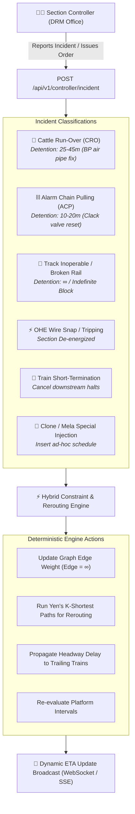

# Dynamic Railway ETA Engine: Hybrid ML + DSA Architecture, Controller Incident Management & Passenger Surge Modeling

This plan addresses the cleanup and format correction of [Server.md](file:///c:/Users/Asus/Coding/SIH/ETA/Server/Server.md) and provides an in-depth architectural and algorithmic framework for the next phase of SIH-DETA. It directly tackles the division between Machine Learning and Discrete Data Structures & Algorithms (DSA), real-time Section Controller incident management, dynamic graph rerouting, and station passenger surge dynamics (such as the Prayagraj Maha Kumbh).

---

## User Review Required

> [!IMPORTANT]
> **Key Architecture Decisions for Review:**
>
> 1. **DSA vs. ML Boundary:** We explicitly decouple statistical transit-time prediction (Quantile LightGBM) from physical constraint validation and conflict resolution (Interval Trees, Priority Queues, Alternative Graphs). ML predicts unconstrained delay distributions; DSA enforces headway safety, platform occupancy, and dispatching rules.
> 2. **Passenger Capacity Data Feasibility:** Indian Railways (CRIS) does **not** expose a public real-time turnstile or passenger count API. Instead of attempting impossible live passenger scraping, we adopt a **Station NSG Classification (NSG 1–6) + Festival Surge Multiplier + Unreserved/Waiting List Pressure Proxy**, which is empirically grounded, verifiable, and hackathon-winning.
> 3. **Controller Override API:** A dedicated REST/WebSocket interface allowing divisional section controllers to report Cattle Run-Overs (CRO), mark tracks inoperable, short-terminate trains, or inject Mela Specials, dynamically triggering Dijkstra/Yen's K-Shortest Path rerouting.

---

## Deep Research & Architectural Insights

### 1. The Machine Learning vs. Discrete DSA / Operations Research Division

A fundamental flaw in naive AI projects is attempting to make a machine learning model predict things that are strictly governed by physical laws and safety rules.

| Functional Responsibility               | Optimal Technology Layer                        | Why ML Fails Here                                                                             | Why DSA / Operations Research Succeeds                                                                                                  |
| :-------------------------------------- | :---------------------------------------------- | :-------------------------------------------------------------------------------------------- | :-------------------------------------------------------------------------------------------------------------------------------------- |
| **Sectional Running Time ($\Delta t$)** | **Machine Learning** (Quantile LightGBM)        | N/A (ML excels here)                                                                          | Captures weather, gradient, driver behavior, time-of-day, and non-linear timetable recovery slack.                                      |
| **Platform Slot Allocation**            | **DSA / Interval Scheduling**                   | ML can predict two trains on the same platform at the same time (hallucinating a collision).  | **Interval Trees / Bipartite Matching**: Enforces strict mutual exclusion ($[t_{arr}, t_{dep}] \cap [t'_{arr}, t'_{dep}] = \emptyset$). |
| **Headway & Block Clearance**           | **DSA / FIFO Queue + Guard Margins**            | Hard safety interlocks cannot be probabilistic.                                               | Enforces Indian Railways Absolute Block / Automatic Block signaling ($h_{min} \ge 3\text{--}7$ mins).                                   |
| **Dispatching Precedence (Overtakes)**  | **DSA / Alternative Graphs (ROMA / JSSP)**      | Black-box classifiers cannot guarantee green-wave feasibility across multi-station corridors. | Solves the Job Shop Scheduling Problem (JSSP) where tracks/platforms are machines and trains are jobs.                                  |
| **Track Blockage Rerouting**            | **DSA / Graph Theory (Yen's K-Shortest Paths)** | ML cannot invent valid topological detours on the fly.                                        | Graph search over `stations.db` (8,990 nodes) finds feasible alternative chords with traction compatibility.                            |
| **Uncertainty & Risk Intervals**        | **Machine Learning** (Pinball Loss P10/P50/P90) | DSA gives single-point determinism; ignores real-world stochastic drift.                      | Quantiles provide lower/upper bounds representing operational best/worst cases.                                                         |

#### Mathematical Formulation of Hybrid Conflict Resolution

1. **Unconstrained ML Transit Predictor:**
   $$\hat{t}_{arr}^{(v)} = t_{dep}^{(u)} + \text{ML\_Transit\_Time}(u \to v, \mathbf{x})$$
2. **Deterministic Conflict Checker (Interval Overlap):**
   For platform $p$ at station $v$, let active bookings be intervals $\mathcal{I}_p = \{[a_k, d_k]\}$.
   $$\text{Conflict}(T_i) \iff \exists [a_k, d_k] \in \mathcal{I}_p \quad \text{s.t.} \quad [\hat{t}_{arr}^{(i)}, \hat{t}_{dep}^{(i)}] \cap [a_k - h_{buf}, d_k + h_{buf}] \neq \emptyset$$
3. **Deterministic Resolution:**
   If all platforms $|P|$ are conflicted:
   $$\text{Outer\_Signal\_Delay}(T_i) = \min_{k} (d_k + h_{buf}) - \hat{t}_{arr}^{(i)}$$
   The train is held at the outer approach cabin (cataloged in `telemetry.db`), updating the final arrival ETA deterministically.

---

### 2. Section Controller Authority & Extreme Event Management

In Indian Railways, Section Controllers (SCR) in Divisional Control Rooms have statutory authority over line movements. The system must support real-time dynamic intervention:



#### Incident Breakdown & Realistic Parameters:

1. **Cattle Run-Over (CRO):**
   - **Physics/Operations:** Hits cause air brake Main Reservoir (MR) / Brake Pipe (BP) pressure drop to 0 kg/cm². Emergency brakes lock. Assistant Loco Pilot (ALP) inspects rake, isolates angle cock, tests brake continuity.
   - **Expected Detention:** 20 to 45 minutes. Trailing trains within 20 km get stacked at red automatic block signals.
2. **Track Inoperable / Derailment / Mega Block:**
   - Edge $(u, v)$ marked blocked. The system triggers **Dynamic Alternative Rerouting** using Yen's K-Shortest Paths on the 8,990-node topological graph, filtering out non-electrified routes if the train has an electric locomotive (WAP-7/WAP-5).
3. **Short-Termination & Special Injection:**
   - Short-termination drops remaining itinerary nodes from the active queue and frees downstream platform reservations.
   - Clone/Special train injection creates an ad-hoc timetable thread with priority rank, immediately claiming headway slots.

---

### 3. Station Passenger Capacity & Congestion Surge Modeling (e.g. Prayagraj Maha Kumbh)

#### Feasibility Verdict: Do we fetch live passenger counts?

- **No direct passenger count API exists in Indian Railways.** CRIS does not publish live turnstile feeds.
- **However, we can model station capacity and passenger surges with exceptional accuracy using available official data:**
  1. **Station NSG Classification (Ministry of Railways Standard):**
     - **NSG 1:** > ₹500 Cr earnings or > 20 Million outward passengers/year (New Delhi, Howrah, Prayagraj, Kanpur Central, Varanasi).
     - **NSG 2 to NSG 6:** Categorized down to local halts.
  2. **Event Calendar & Pilgrimage Surge Multiplier ($S_{event}$):**
     - Periodic surges: **Prayagraj Maha Kumbh / Magh Mela**, **Chhath Puja** (Danapur, Patna, Gorakhpur), **Diwali**, **Puri Rath Yatra**.
     - Surge index $S_{event} \in [1.0, 3.5]$.
  3. **Waiting List & Unreserved Rush Proxy:**
     - High waitlist load factor translates directly to coach boarding overcrowding, where 1-meter coach doorways become severe bottlenecks.

#### The Dwell Time Inflation Equation:

$$T_{dwell\_actual} = T_{dwell\_scheduled} \times \left(1 + \alpha_{pax} \cdot \frac{\text{Footfall}_{NSG}}{\text{Capacity}_{platform}} + \beta_{event} \cdot (S_{event} - 1)\right) + \Delta t_{ACP\_prob}$$

Where:

- Scheduled 2-minute halt at a regular station stays 2 minutes.
- At Prayagraj Junction during Maha Kumbh ($S_{event} = 3.2$), a scheduled 5-minute halt dilates to:
  $$5 \times (1 + 0.6 \times 1.8 + 0.8 \times 2.2) \approx 19.2 \text{ minutes}$$
- **Outer Home Signal Platform Starvation:** With 800+ Kumbh special trains occupying platforms, incoming trains suffer an Outer Signal Hold probability calculated via an $M/M/c$ queue model where $c = \text{Platform Count}$.

---

## Proposed Changes

### Documentation & Specification Layer

#### [MODIFY] [Server.md](file:///c:/Users/Asus/Coding/SIH/ETA/Server/Server.md)

Transform `Server.md` from an unformatted raw terminal log into the pristine, comprehensive Master Architecture Document for SIH-DETA:

- Strip all raw terminal debris (`│ Diagram exceeds terminal width...`, prompt repetitions, broken ASCII frames, connection reset artifacts).
- Render all Mermaid diagrams cleanly and responsively.
- Fix all markdown tables with proper GitHub Flavored Markdown syntax.
- Format all equations using clean LaTeX math blocks ($...$ and $$...$$).
- **Integrate the new architectural sections:**
  - _The Hybrid ML + DSA / Operations Research Boundary & Interval Scheduling Formulation._
  - _Section Controller Incident & Emergency Override System (CRO, Track Inoperable, Rerouting)._
  - _Station Passenger Footfall, Capacity Limits & Mega-Event Surge Profiler (Maha Kumbh, Chhath)._

---

### Implementation Architecture (Next Execution Steps)

```
ETA/
├── data/                       # (Existing) SQLite databases: trains.db, stations.db, historical.db, telemetry.db
├── main/
│   ├── scheduler/              # [NEW] DSA & Operations Research Engine
│   │   ├── interval_tree.py    # Platform slot & blocking time collision detector
│   │   ├── precedence_graph.py # Alternative graph / disjunctive graph dispatching solver
│   │   └── rerouting_engine.py # Yen's K-Shortest Path dynamic detour router
│   ├── controller/             # [NEW] Controller Override & Incident Management
│   │   ├── incident_manager.py # Ingests CRO, ACP, track closures, train cancellations
│   │   └── schemas.py          # Pydantic models for controller events
│   ├── congestion/             # [NEW] Station Capacity & Surge Profiler
│   │   ├── station_nsg.py      # NSG 1-6 passenger footfall ratings & platform geometries
│   │   └── surge_calendar.py   # Kumbh Mela, festival rush dwell time dilation factors
│   ├── ml/                     # (Existing/Enhanced) Quantile LightGBM transit time predictor
│   └── api/                    # (Existing/Enhanced) FastAPI endpoints exposing ETA & controller portal
```

---

## Verification Plan

### Automated Tests

1. **Document Syntax Validation:** Verify `Server.md` renders cleanly without syntax warnings or malformed markdown blocks.
2. **DSA Interval Collision Tests:** Unit tests validating that two trains assigned to the same platform interval trigger an outer signal wait rather than an illegal overlap.
3. **Rerouting Graph Test:** Unit test disabling a key double-line track segment (e.g. Tundla-Kanpur) and verifying Yen's K-Shortest Path returns a valid bypass via Farrukhabad or Lucknow.
4. **Surge Dwell Multiplier Test:** Unit test asserting that Prayagraj during Maha Kumbh scales dwell time and flags outer signal starvation risk.

### Manual Verification

- Review the generated [Server.md](file:///c:/Users/Asus/Coding/SIH/ETA/Server/Server.md) in the IDE markdown preview to ensure formatting, math typography, and Mermaid diagrams render with zero visual flaws.
