# 🚆 SIH-DETA: Visual Architecture & System Presentation
### Comprehensive Visual Diagrams, Process Flows & Operational Blueprints

This document compiles the complete visual presentation of the **SIH-DETA** (Dynamic Estimated Time of Arrival) system for Indian Railways. It visually illustrates the end-to-end multi-tier architecture, the Hybrid ML + Discrete DSA conflict resolution engine, Section Controller incident workflows, station crowd surge models (Prayagraj Maha Kumbh), entity relationships, and real-time dataflows.

---

## 📑 Visual Index

1. [High-Level Paradigm Shift: Naive vs. SIH-DETA](#1-high-level-paradigm-shift-naive-vs-sih-deta)
2. [End-to-End Multi-Tier Pipeline (Tiers 0–7)](#2-end-to-end-multi-tier-pipeline-tiers-07)
3. [The Hybrid Architecture: ML vs. Discrete DSA Closed Loop](#3-the-hybrid-architecture-ml-vs-discrete-dsa-closed-loop)
4. [Platform Slot Allocation & Outer Signal Starvation (Interval Trees)](#4-platform-slot-allocation--outer-signal-starvation-interval-trees)
5. [Section Controller Incident Lifecycle & Rerouting (CRO, Track Block)](#5-section-controller-incident-lifecycle--rerouting-cro-track-block)
6. [Station Passenger Capacity & Pilgrimage Surge Dynamics (Maha Kumbh)](#6-station-passenger-capacity--pilgrimage-surge-dynamics-maha-kumbh)
7. [Complete System Entity-Relationship (ER) Architecture](#7-complete-system-entity-relationship-er-architecture)
8. [Spatial Map-Matching & Approach Cabin Disambiguation (HMM)](#8-spatial-map-matching--approach-cabin-disambiguation-hmm)
9. [Real-Time Distributed Production Infrastructure & API Flow](#9-real-time-distributed-production-infrastructure--api-flow)
10. [System Execution & Verification Gantt Roadmap](#10-system-execution--verification-gantt-roadmap)
11. [Feedback Loop Prevention & Space-Time DAG Marching](#11-feedback-loop-prevention--space-time-dag-marching)
12. [Black Swan Disaster Resilience & 3-Level Degradation](#12-black-swan-disaster-resilience--3-level-degradation)
13. [Adaptive Schedule-Aware Ingestion & Token-Bucket Pacing](#13-adaptive-schedule-aware-ingestion--token-bucket-pacing)

---

## 1. High-Level Paradigm Shift: Naive vs. SIH-DETA

Existing railway apps fail because they assume delays compound linearly. SIH-DETA models non-linear timetable recovery slack, dispatching priority rules, and physical safety caps.

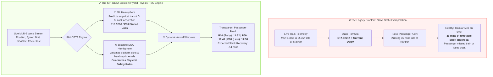

---

## 2. End-to-End Multi-Tier Pipeline (Tiers 0–7)

The end-to-end dataflow across the 7 operational tiers, moving from raw geographic track topology to real-time client delivery.

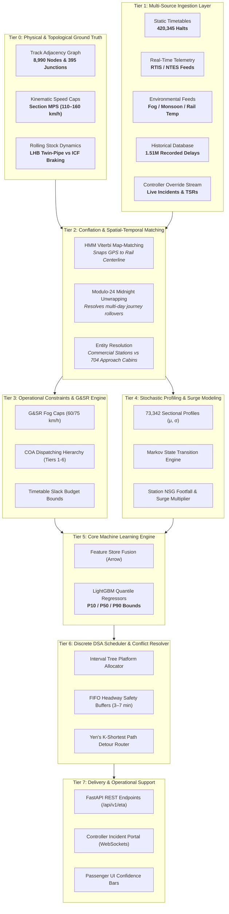

---

## 3. The Hybrid Architecture: ML vs. Discrete DSA Closed Loop

This diagram details the exact algorithmic boundary: **Machine Learning** predicts unconstrained statistical drift; **Data Structures & Algorithms** strictly enforce physical safety and platform availability.

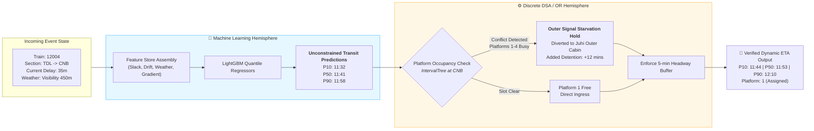

---

## 4. Platform Slot Allocation & Outer Signal Starvation (Interval Trees)

How approaching trains are scheduled into station platforms using **Interval Trees**, and how conflicts are automatically resolved into outer home signal queuing.

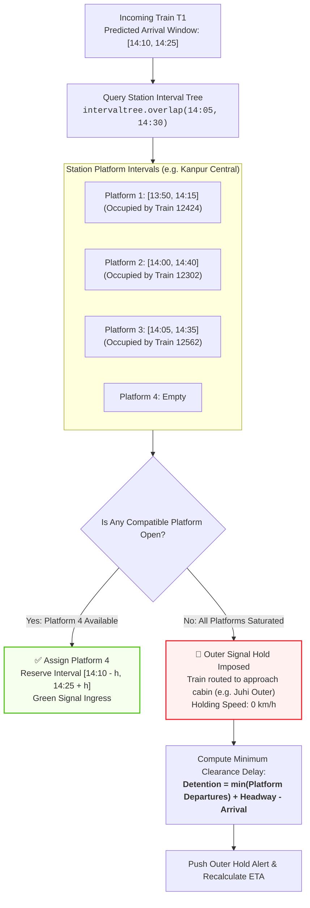

---

## 5. Section Controller Incident Lifecycle & Rerouting (CRO, Track Block)

The end-to-end lifecycle when a **Section Controller** logs a Cattle Run-Over (CRO), Alarm Chain Pulling (ACP), or broken rail incident.

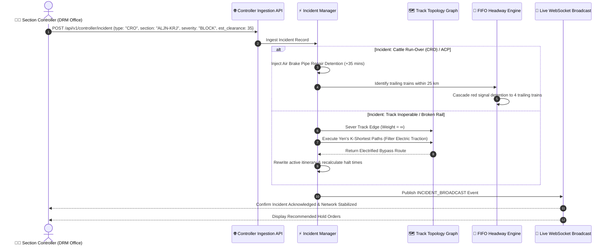

---

## 6. Station Passenger Capacity & Pilgrimage Surge Dynamics (Maha Kumbh)

Visualizing how massive festival crowds (e.g., Prayagraj Maha Kumbh) dilate passenger dwell times and saturate station platforms.

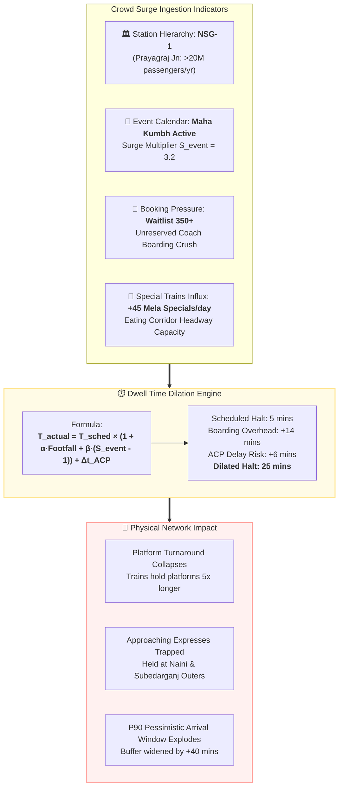

---

## 7. Complete System Entity-Relationship (ER) Architecture

The relational architecture connecting all 6 production databases across trains, stations, telemetry, operational incidents, and platform intervals.

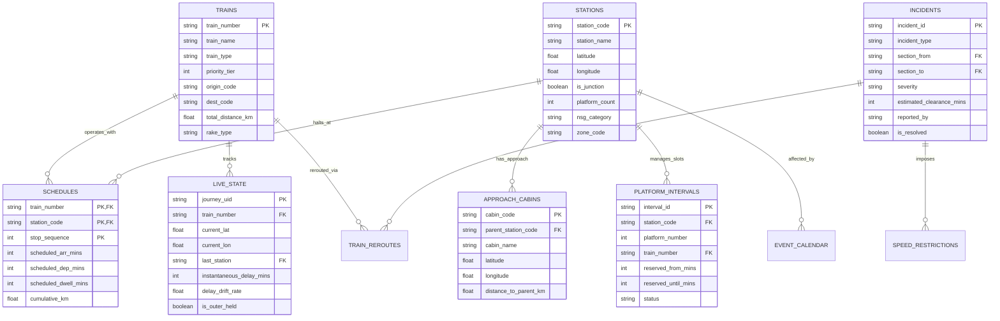

---

## 8. Spatial Map-Matching & Approach Cabin Disambiguation (HMM)

How raw GPS points with multi-path jitter are snapped to physical rail centerlines, and how approach cabins detect outer signal holds before commercial stations.

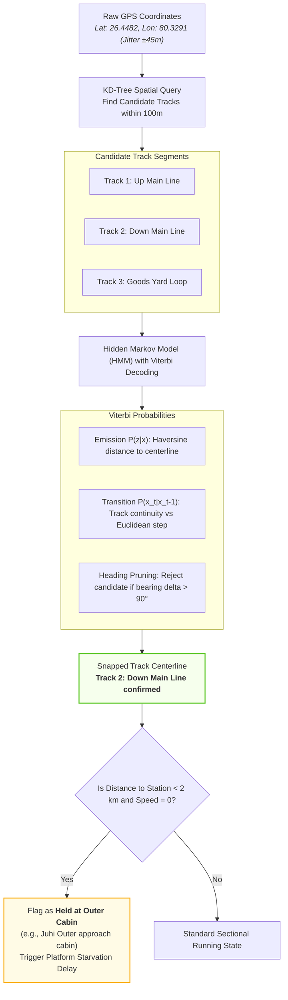

---

## 9. Real-Time Distributed Production Infrastructure & API Flow

The deployment architecture designed for sub-50ms query response times under high-concurrency passenger traffic and continuous controller updates.

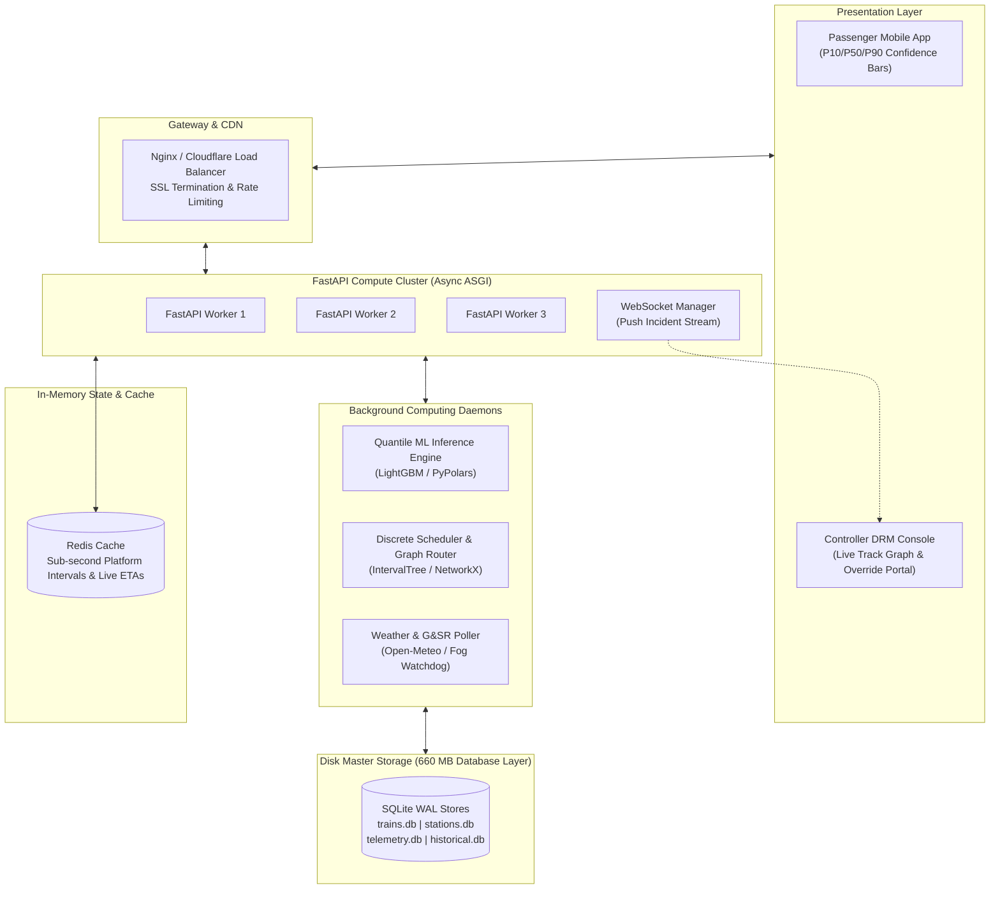

---

## 10. System Execution & Verification Gantt Roadmap

Timeline and milestones for integrating the DSA Scheduler, Controller Portal, and Quantile Engine into the existing 1.5M historical data foundation.

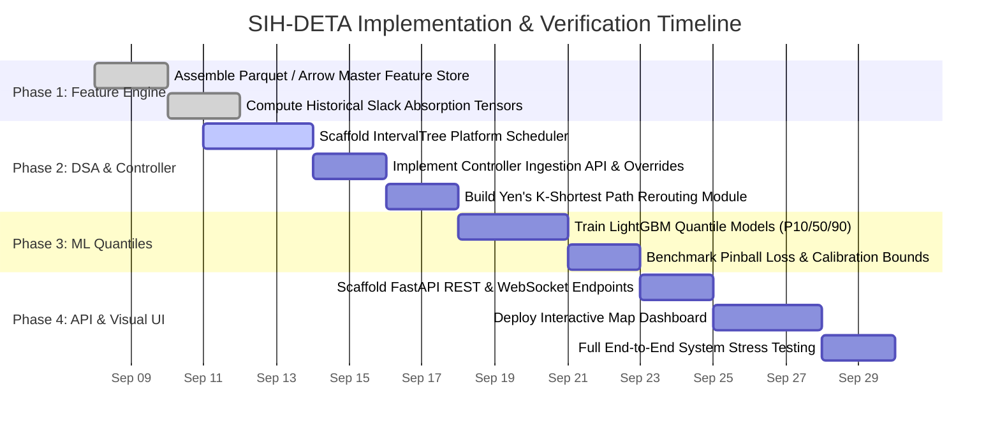

---

## 11. Feedback Loop Prevention & Space-Time DAG Marching

How the hybrid architecture prevents infinite ping-pong loops between Machine Learning and Discrete DSA using a **strictly forward-marching Space-Time Directed Acyclic Graph (DAG)** and a **2-Pass Decoupled Pipeline**.

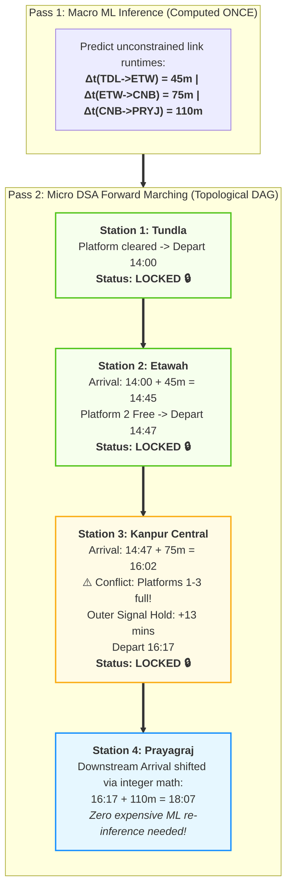

---

## 12. Black Swan Disaster Resilience & 3-Level Degradation

Visualizing the system's fault-tolerant behavior during catastrophic disruptions (massive derailments, grid power blackouts, civil rail blockades) where historical ML models become invalid.

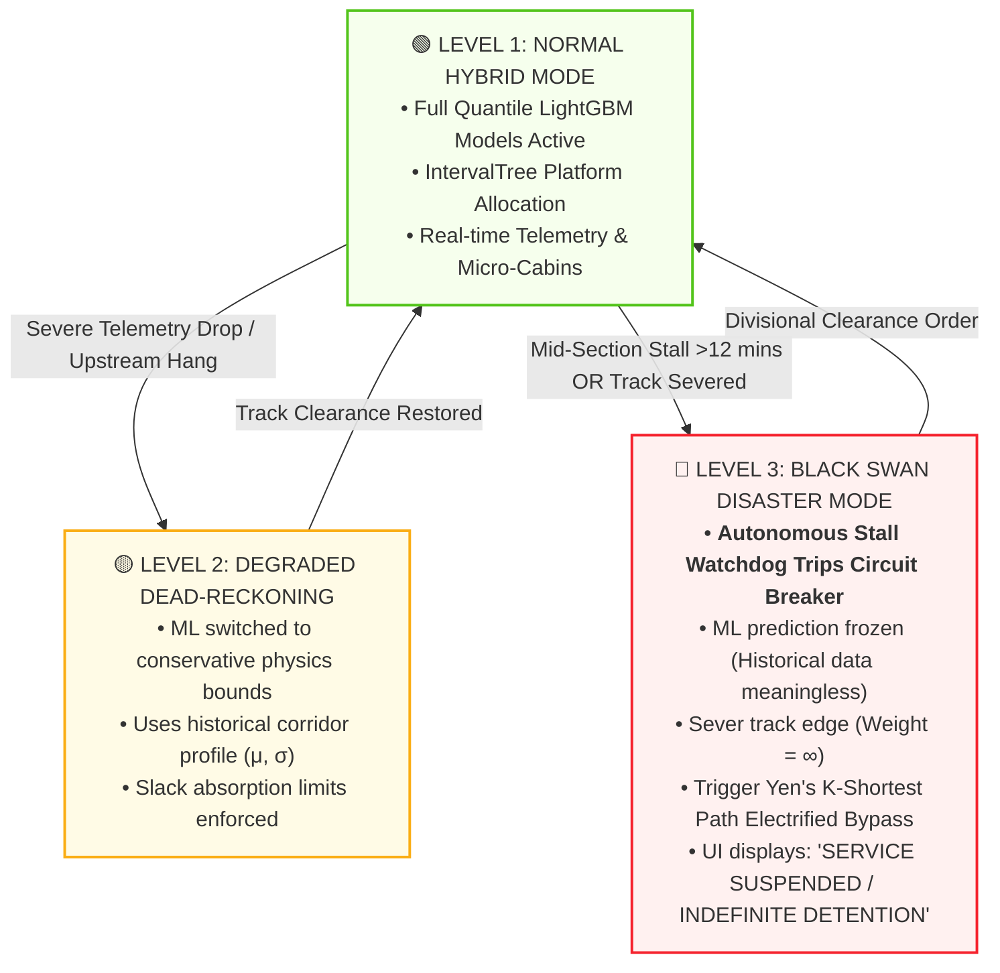

---

## 13. Adaptive Schedule-Aware Ingestion & Token-Bucket Pacing

Visualizing how the system filters out 4,000+ inactive trains, clusters weather into 180 spatial hexagonal cells, dynamically paces polling based on train speed and approach cabins, and guarantees a flat 3.5 RPS traffic profile.

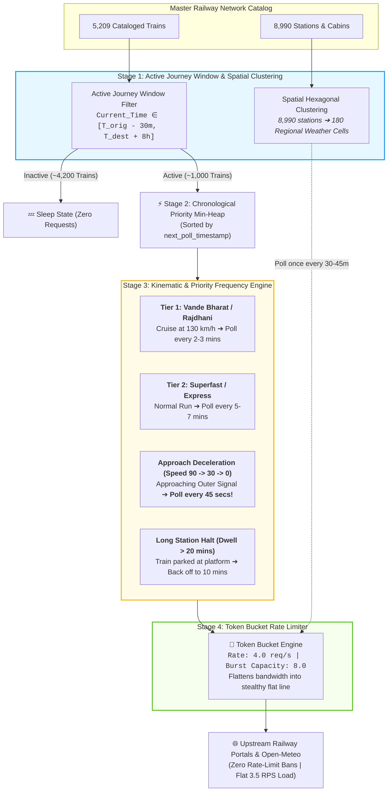

